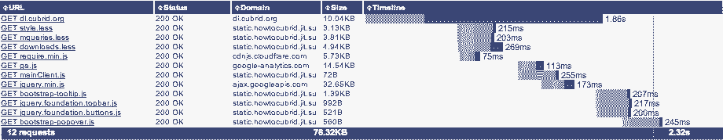

# Pulsr Node.js Web App Framework

> Best decision of my career: Working on Open Source Software, the culture of sharing, encouraging and learning from each other is incredible.
> -- <cite>Dale Harvey [@daleharvey](https://twitter.com/daleharvey/status/275252906293346306)</cite>

**Pulsr** is a very _fast_ Web App Framework for Node.js developers to create **A-graded** Web apps. All LESS/CSS/JS files are properly concatenated, minimized, gzipped, cache-enabled and sent to a client. This is why Google's Page Speed grades Pulsr based sites with **95 out of 100** speed score, and YSlow with **91 out of 100** score. The good news is Pulsr doesn't include all the [Best Practices for Speeding Up Your Web Site](http://developer.yahoo.com/performance/rules.html) suggested by Yahoo! engineers. So, there is a room for further improvement.

Pulsr sites are not only fast from Google/Yahoo point of view, but they also _look fast_ for site visitors because Pulsr sends the first response without waiting for all the heavy work necessary to render the page to be finished like database queries, image processing, etc. Visitors see the basic layout immediately while the rest _data_ of the page is pushed in by the server **in chunks** within the same initial HTTP request (_notice: **no** AJAX!_). This is the same technology used by Facebook on their main site. If you want to learn more about **chunked transfer encoding** read [Faster Web Page Loading with Facebook BigPipe](http://www.cubrid.org/blog/dev-platform/faster-web-page-loading-with-facebook-bigpipe/) I posted last year.

## Pulsr is developer friendly

Pulsr is not complete yet, nothing is ever finished. In fact, I have just started it. With introduction of **pagelets concept** (_discussed further_) **Pulsr is designed to make it very easy for developers, particularly for teams, to build and maintain their Web applications**.

### Client side

UI on the client side consists of independent **pagelets**. This means each pagelet can be developed by a different person in your team, thus you can develop your application much faster.

#### Page structure

For page layout rendering, both client and server side, Pulsr uses [Handlebars](http://handlebarsjs.com/). Right now for server side Handlebars is fixed. For client side, there is no limitation. You can use whatever you want. I will see if I can make the server side be more flexible on this matter.

Every page in Pulsr consists of the following components:

1. Main site layout
2. Page layout
3. Pagelet layout

##### Main site layout

Check out _view/layout.hb_.

Main site layout is pretty static. You most likely will never have to touch it unless you know what you are doing. This layout simply outputs:

1. the opening `html` tag which includes Paul Irish's [conditional `html` tag](http://paulirish.com/2008/conditional-stylesheets-vs-css-hacks-answer-neither) suggestions.
2. the `header` tag with [CSS links at the top](http://developer.yahoo.com/performance/rules.html#css_top) followed by one single JS link to RequireJS which, if necessary, will load other required JavaScript files. Before RequireJS the header also includes configurations in a `script` tag for RequireJS.
3. the opening `body` tag. **Important:** the `body` tag should not be closed because Pulsr is solely based on chunked transfer encoding.

##### Page layout

Eg. _view/front-page.hb_

A page layout is more or less static as well. All it includes is a markup for upcoming pagelets. It may also include other markup like the topbar, a header with a product or company logo, i.e. static page layout. Everything else which is dynamic that may slow down the response should be loaded through pagelets.

**The idea here is** - send something, anything to the client **as soon as possible** so that the browser starts working by loading required static resources and rendering the initial page. This is very important. Here is why.

When using a common Web framework, after it receives a request for a particular page, it start building the page markup on the server side filling out with contents retrieved from a database, doing other important work like logging, user tracking, etc. All this takes time, but during this time the client browser is twiddling its thumbs - a whole waste of time and resources. But when the server has done building the page, it sends the response to the browser, and now the browser is super busy loading all the static resources and then rendering the page as shown in the following screenshot.


What Pulsr does (**Figure 2**) is it sends the initial page template (eg. _layout.hb_ + _front-page.hb_) to the client browser as soon as possible. While it keeps working on building the pagelets included for the requested page, by retrieving their data from a database or a remote server, the browser is already busy with loading page resources. At some point Pulsr sends the second chunk with, let's say, the layout and data of _pagelet 1_. The browser immediately starts loading the resources of this pagelet and starts rendering its layout. This continues until Pulsr finishes sending all pagelets' data.



Using chunked transfer encoding, Pulsr allows to dramatically increase the overall page load time which is highly favored by search engines. Moreover, this gives your site visitors the feeling of pages loading faster. This is Psychology, and it works!

A page layout can be as dry as the following _front-page.hb_ of a demo Pulsr site. The site pagelets will go inside, for instance, `div#pageView`. It is not a rule, so you can control this within each of your pagelet.

````
<div id="fb-root"></div>
<div class="fixed">
    <nav class="top-bar">
      <ul>
        <li class="name"><a>App name</a></li>
      </ul>
    </nav>
</div>
<div class="row">
    <div class="nine columns centered">
        <div class="row" id="pageView"></div>
    </div>
</div>
````

##### Pagelet layout

Now this is the most interesting! The concept of **pagelets** is really cool! From developers' perspective, pagelets help to split the work into multiple **independent** tasks, which the team members can work on separately. Developers create their own pagelets which later can be included and **reused** in multiple pages. Very convenient!

Under _/pagelets_ directory you will be creating and keeping these pagelets. Each of them should do something distinct (_that's the whole point_). For example, your blog page may consist of a post content, a blogroll, a list of blog categories, a section about the author, in addition to Google Analytics tracking code even though it is not something that will be visible to your site visitors. In this case you can create five different pagelets each of which output its own layout, content, scripts, etc.

A pagelet which has some visual markup to display to a client should consist of two parts:

1. A DOM element, which wraps the pagelet itself and has `class="chunked hide"`. That is, the pagelet's HTML should go in this wrapper. Let's call it a _pagelet container_.
2. A JavaScript code in `script` tag which moves the pagetlet from its parent hidden container to a target DOM element as defined in the _page layout_.

If a pagelet does not display anything, like the Google Analytics (GA) tracker, the developer does not need to send the pagelet container. In this case, the `script` tag may hold GA's tracking code itself. For an example take a loot at GA pagelet in _pagelets/ga/ga.js_. It does not need any visual manipulation, so it sends only GA tracking code in a `script` tag.

Thus, pagelets should never care about where on the page they will be displayed. This shakes off the responsibility from developers to UI designers, though for most of teams this may be the same person.

The pagelet location should be defined in _page layout_ by an `id` attribute of some DOM element. The developer will simply move the pagelet from its wrapper to its target location through jQuery or plain JavaScript, whatever is convenient.

At this point you may ask _what if JavaScript is turned off on the client?_

There are two LESS/CSS rules defined to be used by _pagelet containers_:

````
.chunked.hide {
  display: none !important;
}
.no-js {
    .chunked.hide {
        display: block !important;
    }
}
````

To remind, a pagelet container is any DOM element which holds some pagelet in plain HTML. The container also specifies the `class="chunked hide"`. It means when JavaScript is enabled, all pagelet containers are invisible to users so they will not see anything blinking at the bottom of the page. The pagelet's JavaScript will then move the pagelet from the container to its proper location which will make it visible to users.

 If JavaScript is disabled, the `.no-js` class will apply which will make the pagelet container visible, so the incoming pagelet data will be visible to users anyway. Moreover, the pagelets will still be beautifully styled with your CSS. The only concern is that the pagelets will be out of order as they come from Pulsr.

Thus this approach provides several advantages over using AJAX:

1. No extra HTTP request.
2. No problem with cross-site requests as all data is served by the origin server which, if necessary, performs cross-site requests.
3. Your users will always be able to see what you have for them despite JavaScript being turned off, unlike with AJAX.


### Server side

Pulsr is [AMD](http://www.cubrid.org/blog/dev-platform/toward-javascript-standards-commonjs-and-amd/) compliant. Everything in Pulsr is in modules which are loaded by [RequireJS](http://requirejs.org/). Modularity will allow you to develop and maintain pieces of your application independently from the rest of the application. It is so awesome that JavaScript as a language will included a native support to modules in [ECMAScript.next](http://addyosmani.com/blog/a-few-new-things-coming-to-javascript/), perhaps, in the year 2013.

RequireJS is so cool that it not only loads modules on demand and manages their dependencies, but also allows to interpret the code only once. This means that your entire applications once loaded and interpreted sits in the memory. More than that, with RequireJS you can share data between client requests through local module variables or cache. One example is retrieving some information from a database or a remote server once and keeping it in a local to module variable or a global cache. This is true for both server and client side usage of RequireJS. I will explain more about this later in a separate post.

#### Client-side JavaScript

Pulsr provides automatic (_but configurable_) minification, uglifying, and [gzipping](http://developer.yahoo.com/performance/rules.html#gzip) your client side JavaScript files. By default these scripts are [cached](http://developer.yahoo.com/performance/rules.html#expires) by browsers which means your server will not be stressed too much. This will give your app higher speed score. In development environment you can either turn it off or set a lower `maxage` value for Cache-Control. I have yet to implement the version control for static files including CSS for production environment.

When you change any of your JS files, they get rebuild on the next client request. Further on only compiled files are served to a client.

#### LESS/CSS

Pulsr provides [Zurb Foundation CSS Framework](http://foundation.zurb.com/). It is a really powerful one with slick UI. If you prefer [Twitter's Bootstrap](http://twitter.github.com/bootstrap/), you can replace it easily. All LESS/CSS files are also grouped, concatenated, gzipped and served to a client. By default, they are also cached by browsers with the same settings as JavaScript resources.

When building your site, oftentimes you do not need the entire CSS framework be loaded. Pulsr allows to group LESS files and request different resources for different pages. At the same time, it is very likely that you have a set of CSS rules which are common for all pages, eg. normalize, grid, typography, media queries, etc. These will be included on every page before the page-specific CSS.

Since [iPhone will not cache resources over 25KB](http://developer.yahoo.com/performance/rules.html#under25), in Pulsr final minified and gzipped CSS do not surpass 25KB in size. For this reason the common CSS is divided into two files: a) main _style.less_ b) _mqueries.less_. So, on any page Pulsr includes two or more CSS resources. For the same reason, when developing your CSS rules, consider this iPhone limitation and divide your files into two if they are growing above 25KB.

As with JS files, LESS files are rebuilt every time root LESS files are changed. I have yet to implement so that Pulsr rebuilds also when imported/nested LESS files are changed.

#### File structure

The following is the _current_ file structure of Pulsr Web App Framework. Until it gets stable, there is a possibility that it may change. In fact, I do have plans to change it significantly in the upcoming pre-stable releases when adding multi-site support

  _When will Pulsr be stable?_ When I develop a fully featured URL Manager for Pulsr. Right now it is limited to plain regular expressions, which, if matched, relay the request to a corresponding controller. Until then I will consider it as evolving and unstable, and you should use it on your own risk.

So, here is how Pulsr's skeleton looks like.

````
contents/	// here you place your static pages
controller/	// here you define modules which respond to user requests
docs/		// documentation of Pulsr generated by docco
img/		// here go your image files
js/		// here go JS scripts which you server to a client
less/		// for your LESS/CSS files
pagelets/	// here you define pagelets (modules by nature) which can be used by controllers
    /ga		// a pagelet for Google Analytics tracker
        /ga.js	// the pagelet script
        /ga.hb	// the pagelet layout
pulsr/		// the core Pulsr modules
views/		// here you place your layout files which are later compiled by Handlebars
    /layout.hb	// main site layout
    /front-page.hb // a page layout for a front page (/)
.gitignore
app.js		// main entrance script for Pulsr which is also defined in package.json
favicon.ico	// further follow favicons and touch icons as recommended by HTML5-boilerplate project
apple-touch-icon.png
apple-touch-icon-precomposed.png
apple-touch-icon-57x57-precomposed.png
apple-touch-icon-72x72-precomposed.png
apple-touch-icon-114x114-precomposed.png
apple-touch-icon-144x144-precomposed.png
humans.txt	// a file about the developers of the project. You can include yourself as well.
package.json
README.md
robots.txt	// for search engines
````

#### Request flow

##### app.js

The entrance/start script for Pulsr project is **app.js** located in the root of the project. If you want to run locally, you do:

	node app.js

**app.js** file is already defined in **package.json** as a start script.

	"scripts": {
    	"start": "app.js"
	}
	
So you can deploy your Pulsr project directly to [Nodejitsu](http://nodejitsu.com) or similar cloud platforms.

When you start **app.js** it loads the configuration file from **conf.js** and the HTTP server from **server.js**. The server listens to a port defined in **conf.js**.

##### server.js

Then the server passes a callback to **url_manager.js**. 

##### url_manager.js

When a request comes in the URL Manager decided which controller has to be loaded based on the request URI. Since all modules in Pulsr are loaded by RequireJS, they are loaded and interpreted by Node.js only once. This means no matter how many requests come in, a controller will be loaded only once at the very first time. Every next time, the controller will be served from the memory.

##### url_patterns.js

URL Manager loads **url_patterns.js** where the developer defines an object with keys and values where keys represent the regex, which should match the request URI, and values represent the controller name, which should handle the request. See the module snippet below.

```
define(function() {
	return {
		// sorted by priority: the first one matched will process the request
		'/': 'front_page',
		// blog and all kinds of content requests can be handled by the same
		// "blog" controller
		'/blog(/([\\w-]+)*)*': 'post',
		// The below will match everything else: used as the last option.
		// DO NOT remove it or the response will never be returned.
		'/.*': 'fileHandler'
	};
});
```

##### Controller

When URI matches one of the URL patterns, the URL Manager loads the corresponding controller from */controllers* directory which is then instructed to handle the request.

###### fileHandler.js

Usually controllers are written by developers. However, there is one *core* controller in */pulsr* directory called **fileHandler.js**. This module handles the static file requests such as JavaScript files, CSS files, images, etc. If you take a look at **url_patterns.js**, you will notice that **fileHandler** controller is the last *fallback* option defined which matches basically *anything* the previous patterns could not match. It should not be removed, or else in case no patterns match, no response will be returned to the client.

When no patterns match, the **fileHandler** controller will be matched which will try to find the static file being requested, if there is any. If no file is being requested, or the file is not found, 404 HTTP error is returned.

Developer can further extend **fileHandler** controller. Currently there are two extensions:

1. **js.js** (*pulsr/fileHandlers/js.js*): a file handler which handles requests for JavaScript files. It optionally minifies, uglifies, and gzips the file then sends to a client.
2. **less.js** (*pulsr/fileHandlers/less.js*): a file handler which handles LESS/CSS files reqeusts. Optionally minifies, uglifies, and gzips the file then sends to a client.

You can, for intance, have image file handler which would preprocess and send image files based on the user agent of the client. Eg. for mobile devices you would serve smaller images, for desktops - large images, etc.

If no specific file handler is found based on the mime type of the requested file, the base **fileHandler** will handle the request. Multiple mime types can be handle by one file handler.

###### User controller

You can create two types of controllers:

1. **View controller** which renders some view to display to a client.
2. **Headless controller** which handles RESTful requests.

####### View controller

The following is a sample user controller from *controllers/front_page.js* which handles requests for a front page of a Web site for '**/**' URI.

```
define(['underscore', 'base', 'module'], function(_, BaseController, module) {
	var controller = new BaseController();

	return _.extend(controller, {
		title: 'My Node.js app based on Pulsr',
		moduleId: module.id,
		layout: 'front-page',
		css: ['front-page.less'],
		pagelets: [
			{name: 'ga'}
		]
	});
});
```

Since the entire page is built from pagelets, as explained above, you can notice that the *view controller* doesn't include any code which has anything to do with displaying some content to a client. All the markup which will be sent to a client is generated by one or more pagelets defined in this *view controller*. In other words, if no pagelet is defined, nothing will be displayed to a client.

The **front-page** *page layout* that is indicated in the above *view controller* prepares an HTML markup (placeholder) for the defined pagelets. This way the pagelet developer does not have to think or care about where and how the pagelet will be displayed on the page. The front-end developer will handle that. For example, your pagelet would simply output the JSON object with data, while on the client side the view rendering would be handled by, let's say, a Backbone Model and View, which knows already where to create and insert new DOM elements based on your JSON data. Or if you prefer AngularJS, your pagelet would output angular-ready markup.

Requirements for a *view controller* are:

1. Must inherit from a **BaseController** (*/pulsr/base.js*).
2. Parent properties must be extended for the following properties:
	1. `title`: title of the page
	2. `moduleId`: an ID of the current controller auto set by RequireJS.
	3. `layout`: a page layout for this controller located at */views* directory.
3. Optional properties that can be extended:
	1. `css`: an optional array of custom CSS/LESS files which should be loaded for this page.
	2. `pagelets`: an optaional array of various pagelets that should be loaded for this page. Pagelets can be nested, i.e. one pagelet can have multiple inner pagelets which are loaded **after** the parent pagelet is loaded.

####### Headless/RESTful controller

A headles controller may look like the following from */controllers/api.js*.

```
/*
    api.js
    A headless controller module to perform client site API actions.
 */
define(['underscore', 'base', 'module', 'cubrid', 'conf'], function(_, BaseController, module, CUBRID, conf) {
    var controller = new BaseController();

    return _.extend(controller, {
        moduleId: module.id,
        handle: function (request, response) {
            var method = request.method.toLowerCase();

            if (!this.hasOwnProperty(method + '-actions')) {
                // Method Not Allowed
                response.statusCode = 405;
                response.end();
            }
            else{
                var action = request.params[1];

                if (!this[method + '-actions'].hasOwnProperty(action)) {
                    // Method Not Allowed
                    response.statusCode = 405;
                    response.end();
                }
                else{
                    this[method + '-actions'][action](request, response);
                }
            }
        },
        'get-actions': {
            // this API is called from client
            someGetAction: function (request, response) {
                // first make sure this request is generated from our own site
                if (request.headers && request.headers['host'] && request.headers['host'].indexOf(conf.app.domains.root) == 0) {
                    // handle the request
                }
                else{
                    // prohibited
                    response.statusCode = 403;
                    response.end();
                }
            }
        },
        'post-actions': {

        },
        'put-actions': {

        }
        // other actions
    });
});
```

Requirements for a *headless controller* are:

1. Similarly, must inherit from a **BaseController** (*/pulsr/base.js*).
2. But now it must override the main **handle()** function which for *view controller* used to output main layout, page layout, handle loading and displaying of pagelets, etc. For a headless controller these actions are not required, so **handle()** must be overriden. In the new release I will create wrap all these in a new Pulsr controller which inherits **BaseController**. Then you can simply inherit this **HeadlessController** with no need of overriding anything. So, it will come in the next release.

## What's next

This is the first public release